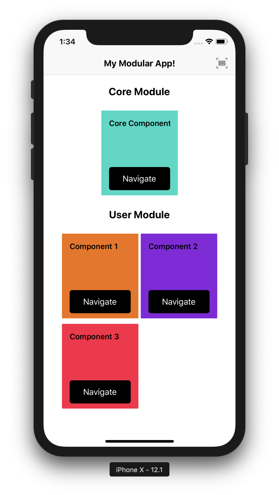

# React Native Modular
Modular app with React Native
<p align="center">

</p>

## Modules
- **CoreModule**: TODO:Describe the common components, the minimum dependencies that the app has, the utilities and common methods to reuse code through the different modules.
```
src/
├── components
│   ├── HomeComponent
│   └── CoreComponent1
├── constants
├── services
│   ├── Navigation
│   ├── Network
│   └── Utils
└── modules
│   ├── UserModule
│   └── ...
└── package.json
```
- **UserModule**: TODO:Describe the purpose of this module in the business, the components that the module has, services and other utilities.
```
UserModule/
├── components
│   ├── Component1
│   └── Component2
├── constants
├── services
│   ├── Service1
│   └── Utils
├── readme.md
└── package.json
```

## Style Guides
- [Airbnb React/JSX Style Guide](https://github.com/airbnb/javascript/tree/master/react)

## Resources ⛩
- [How to structure your project](https://medium.freecodecamp.org/how-to-structure-your-project-and-manage-static-resources-in-react-native-6f4cfc947d92)
- [Hooks](https://reactjs.org/blog/2019/02/06/react-v16.8.0.html)
- [React Native Navigation Patterns](https://codeburst.io/react-native-navigation-patterns-9c2b6d15ddb3)